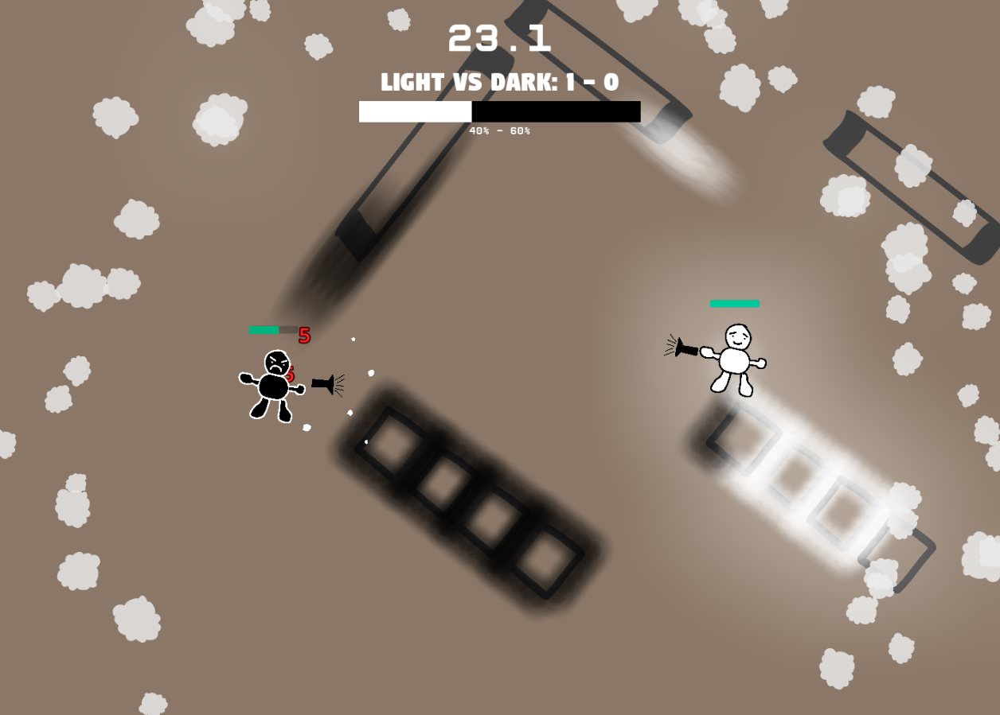

# Photon Phighters :boxing_glove::flashlight::video_game:

- [Photon Phighters :boxing\_glove::flashlight::video\_game:](#photon-phighters-boxing_gloveflashlightvideo_game)
  - [:book: About](#book-about)
  - [:computer: Development Setup](#computer-development-setup)
    - [:package: Dependencies](#package-dependencies)
    - [:floppy\_disk: Formatting](#floppy_disk-formatting)
  - [:joystick: Gameplay](#joystick-gameplay)
  - [:trophy: Tournaments](#trophy-tournaments)
    - [:earth\_americas: PP Alpha World Tour](#earth_americas-pp-alpha-world-tour)
    - [:eu: European Open Photon Phiesta](#eu-european-open-photon-phiesta)
    - [:us: 3 NA Regional Circuit Summer Split 2023](#us-3-na-regional-circuit-summer-split-2023)
    - [🎓 Photon Phighters \& Weave Graduation Bash Bonanza Blitz Showdown 2024](#-photon-phighters--weave-graduation-bash-bonanza-blitz-showdown-2024)

## :book: About 

    </img>

A game by [theowiik](https://github.com/theowiik), [erikwessman](https://github.com/erikwessman), and [elias-carlson](https://github.com/elias-carlson) for "March Game Jam 23'" https://itch.io/jam/march-game-jam-23.

The final state of the game jam can be found in the [game-jam-final](https://github.com/theowiik/project-epicfootsies/tree/game-jam-final) branch.

## :computer: Development Setup

Dependencies and formatting.

### :package: Dependencies 

- Godot 4
- DOTNET 7

### :floppy_disk: Formatting 

The project must be formated with <https://csharpier.com/>.

## :joystick: Gameplay 

In Photon Phighters, two teams battle to cover the map with light or darkness by firing their flashlight.

Players can also attack their enemy to stop them from coloring the map. The team who has covered the largest area of the map after each round wins.

After each round the losing team gets to choose a power-up which will help them in the next round.

## :trophy: Tournaments 

### :earth_americas: PP Alpha World Tour 

1. Erik
2. Elias
3. Theo
4. Arvid

### :eu: European Open Photon Phiesta 

1. Erik
2. Victor
3. Elias
4. Theo

### :us: 3 NA Regional Circuit Summer Split 2023 

1. Theo
2. Victor
3. Erik
4. Elias

### 🎓 Photon Phighters & Weave Graduation Bash Bonanza Blitz Showdown 2024

1. Elias & Theo
2. Victor & Stefan
3. Erik & Jonathan

*standin/wildcard*: Renato